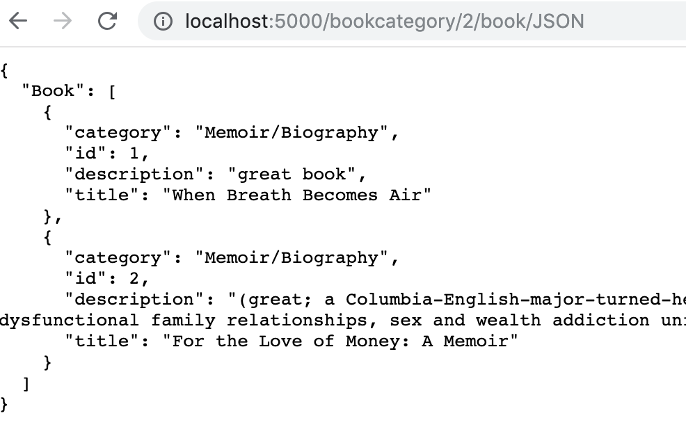
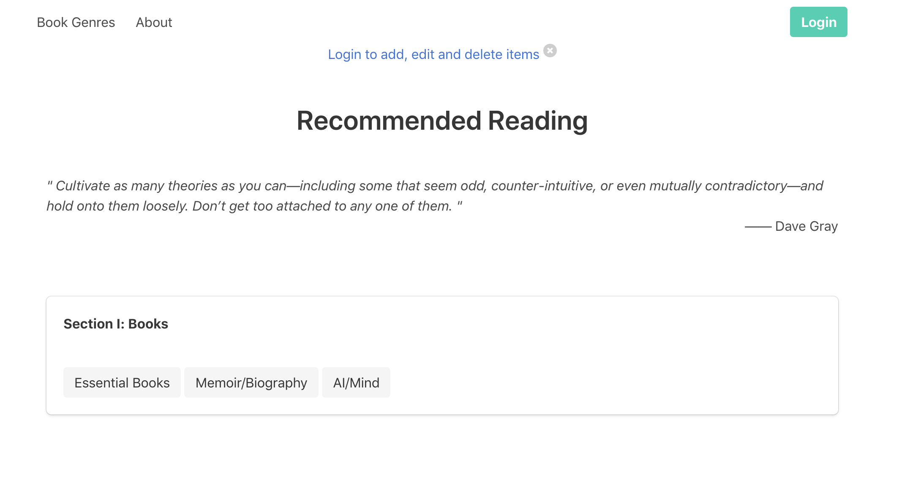
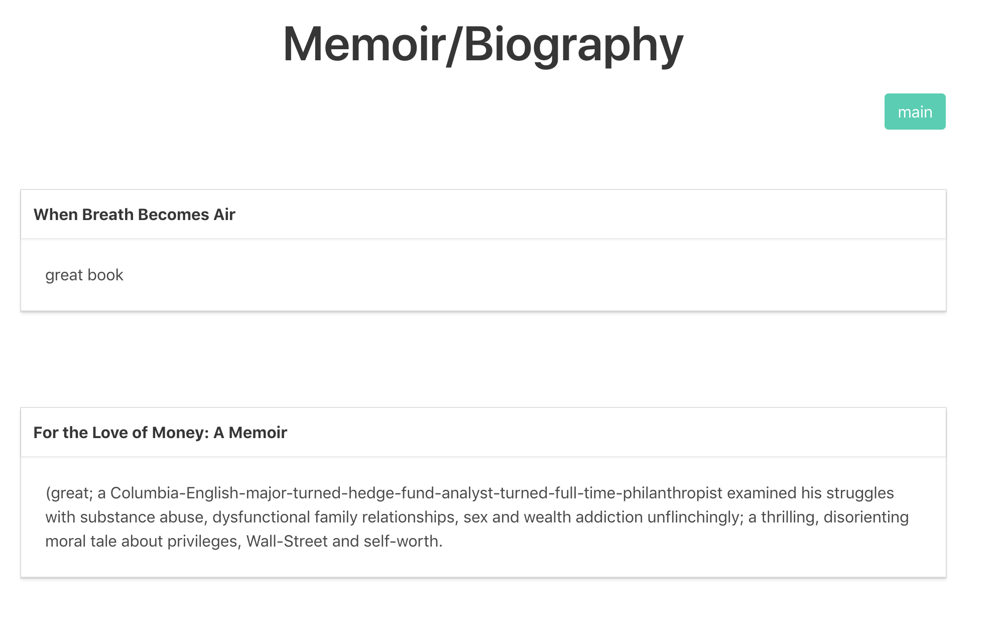
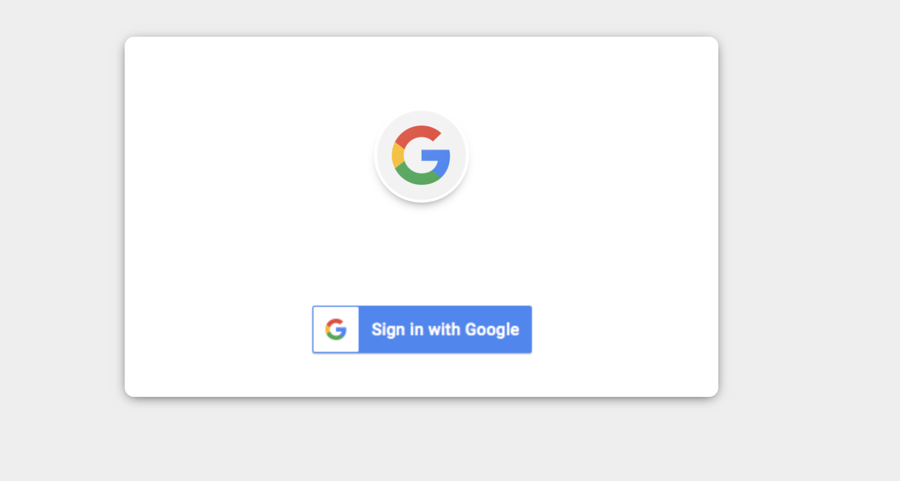
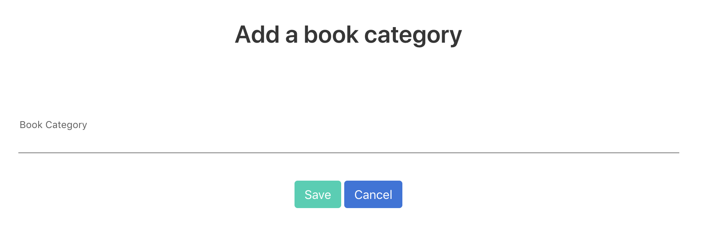
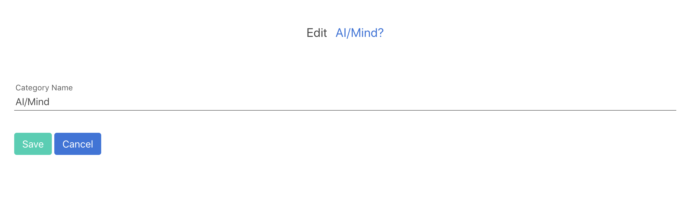
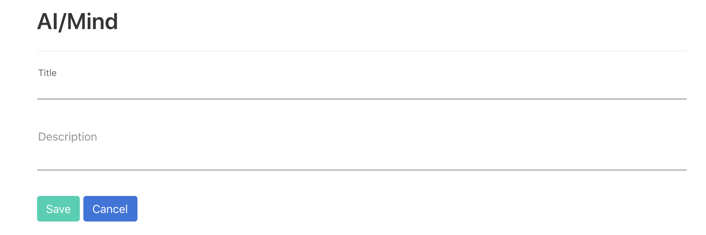
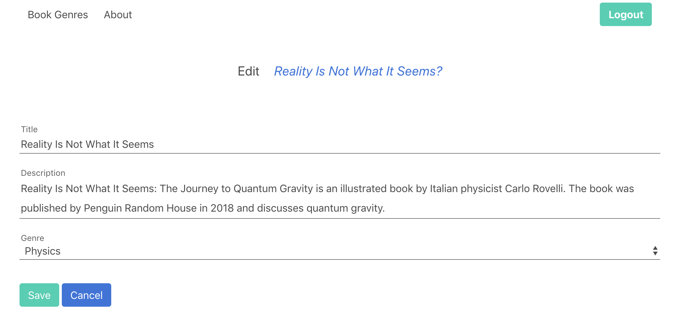

# Reading List Flask website

Python Flask CRUD web app with sqlalchemy, Google oauth2client , and Flask-login.

[](https://choosealicense.com/)

## Table of Contents <!-- omit in toc -->
* [Instructions](#instructions)
* [Website Views](#website-views)
   * [JSON](#json-api)
  * [Display for anonymous users](#display-book-categories-from-pre-populated-database-to-an-anonymous-user)
  * [Authentication](#authentication-with-google-by-clicking-login-in-menu-bar)
   * [CRUD](#crud)
- [Description of Model](#description-of-model)
- [Repository contents](#repository-contents)
- [Trouble-shooting](#trouble-shooting)

## Instructions

If vagrant is not installed in your machine, download vagrant first.
Initiate vagrant virtual environment:

```shell
vagrant up
vagrant ssh
cd /vagrant
```
If you can't see the files, try the following command:
```shell
vagrant reload
vagrant ssh
cd /vagrant
```
Create the database:

```shell
python database_setup.py
```

Populate the database:

```shell
python lotsofbooks.py
```

Run app

```shell
python app.py
```

Go to: [http://localhost:5000/](http://localhost:5000/)

**Note that Google will reject sign-in from [http://0.0.0.0:5000](http://0.0.0.0:8000).**
**Login might take a few seconds.**

## Website Views

- ### JSON API
- #### Get book categories: (http://localhost:5000/bookcategory/JSON). If a user is not logged in, then the categories will come from the pre-populated database.

  

- #### Get books under a given category: Just go to the book page for that cateogory and add '/JSON' to the url. For example:
  (http://localhost:5000/bookcategory/2/book/JSON)
  

* ### Display book categories from pre-populated database to an anonymous user

  

* ### Display books under the Memoir/Biography category from pre-populated database to an anonymous user.

  

* ### Authentication with Google by clicking 'Login' in menu bar

  

- ### CRUD
      -- A user can create, delete or edit a book category or a book created by the user.
  
  
  
  

[(Back to top)](#top)

## Description of Model

Database schema:

#### User:

- id
- name
- email
- picture
- book_categories
- books

#### BookCategory:

- id
- description
- user_id
- user
- books

#### Book:

- id
- title
- description
- book_category_id
- book_category
- user_id
- user

I factored the Flask app into three blueprints: readinglist, auth and api for modularity. Please read below about what each blueprint does. I used flask-login package to manage views, so that when a user types in a url that she or he is not authorized, the user will be directed to the Google log-in page.

## Repository contents

- [app.py](app.py): Initiate Flask app
- [database_setup.py](database_setup.py): Set up the database.
- [lotsofbooks.py](lotsofbooks.py): Populate the database.
- [model/](model)

  - [readinglist.py](model/readinglist.py): Create app routes for all CRUD functions for both book category and book.
  - [api.py](model/api.py): Python file used to populate the database.
  - [auth.py](model/auth.py): Create a user authentication system using Google library oauth2client, enable log-in, log-out.

  - [user.py](model/user.py): Create a user in the database based on user information returned by API call to oauth2client, used by auth.py

- [static/](static)

  - [img/](static/img): Images used in the main application.
  - [css/](static/css): CSS files used in the main application.

- [templates/](templates): HTML webpage templates.

[(Back to top)](#top)

## Trouble-shooting

- Google sign in returns 404
  Solution: Add www.localhost:5000 to the redirect_uris.
- Change in style.css not reflected in the page
  Solution: Clear cache, cmd + shift + delete for Chrome in Mac

[(Back to top)](#top)
